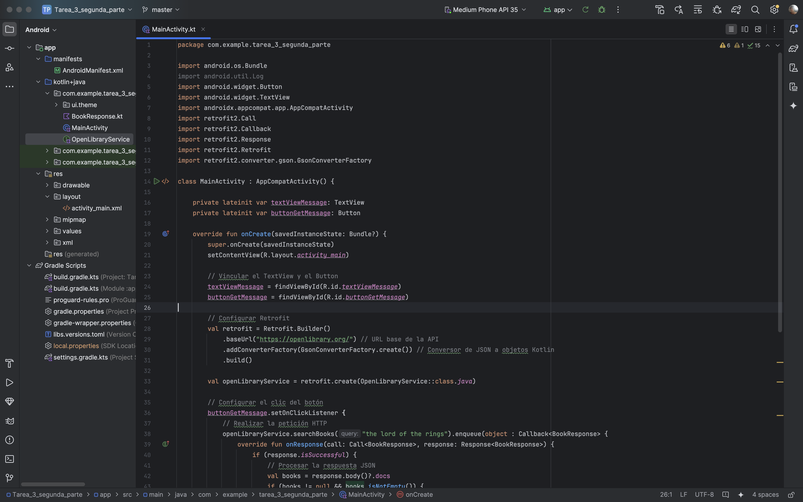
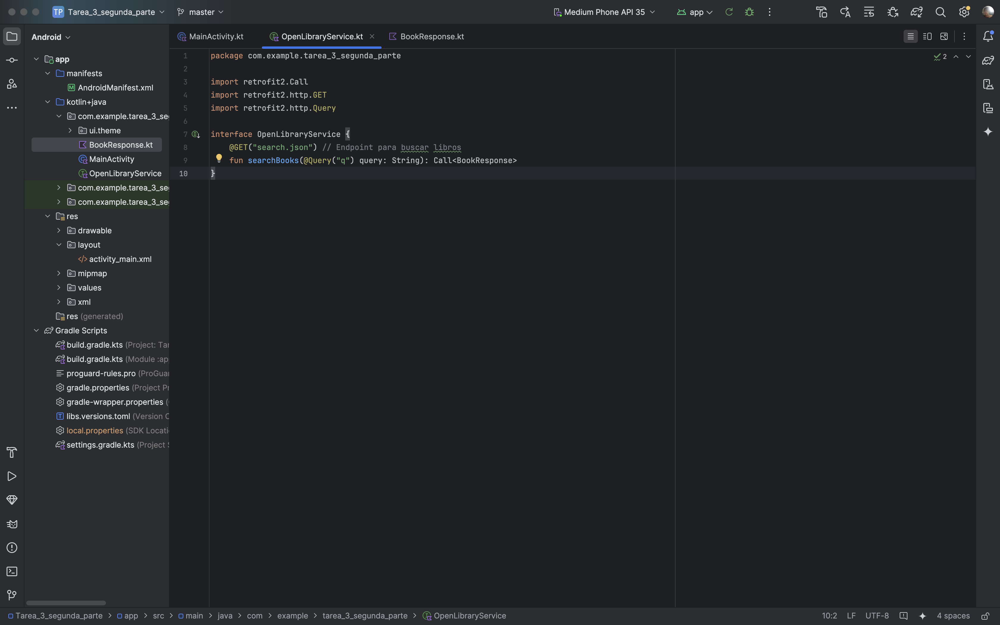
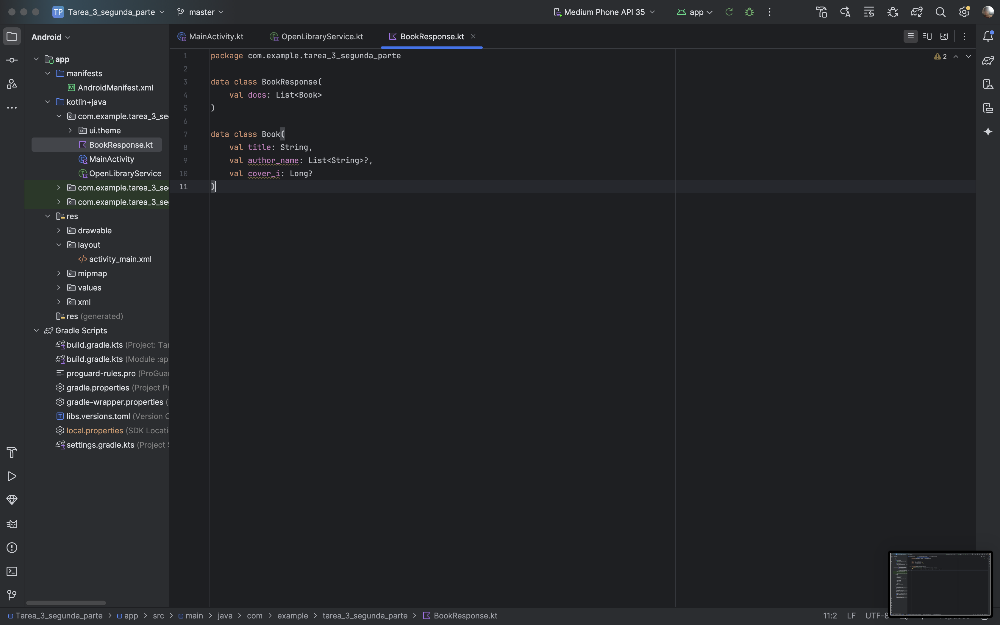
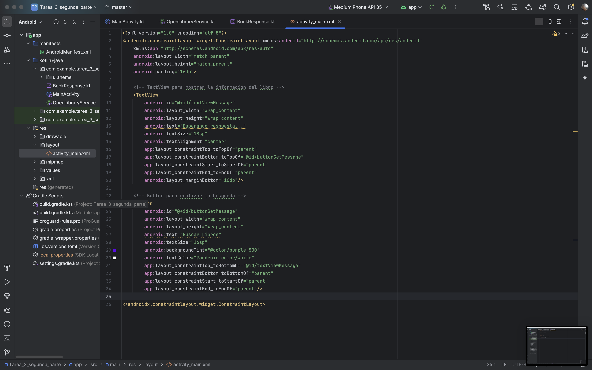
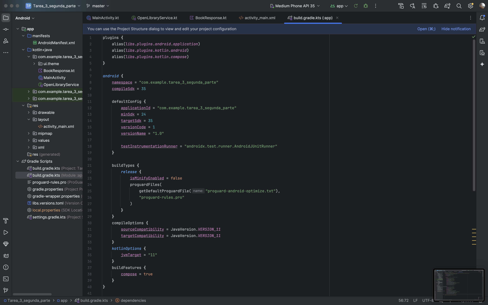
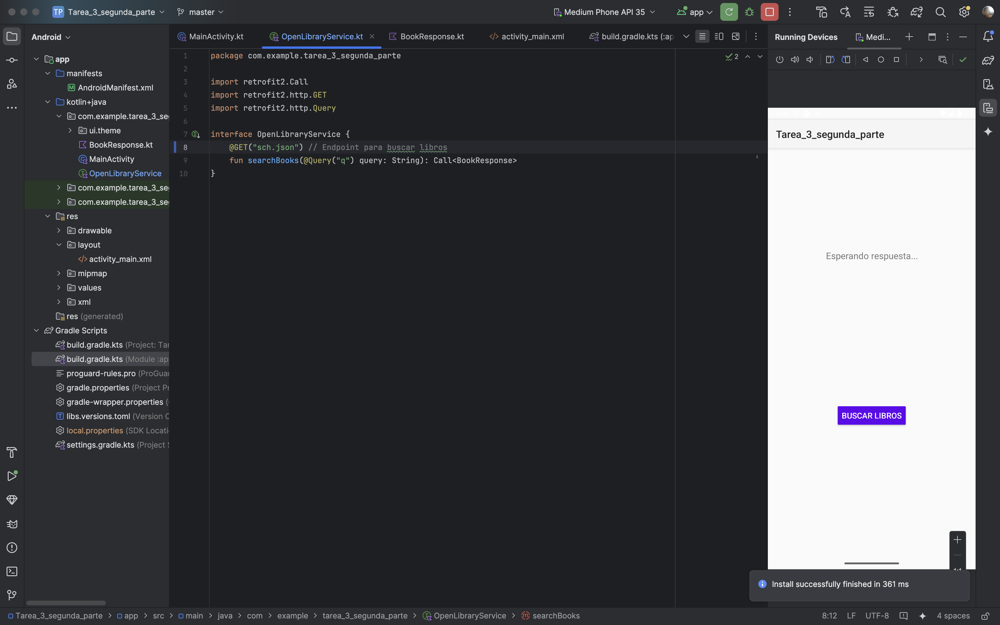
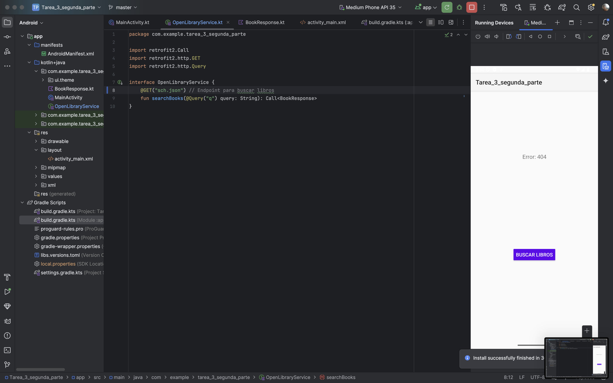
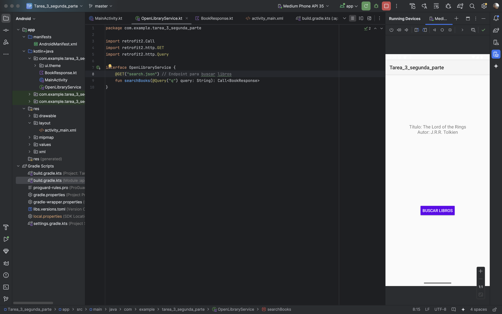

# Aplicación Android con API Pública (Open Library)

## Descripción del Proyecto
Este proyecto consiste en una aplicación Android que consume una API pública (Open Library) para buscar libros y mostrar información básica como el título y el autor. La aplicación utiliza **Retrofit** para realizar las peticiones HTTP y procesar las respuestas JSON.

---

## Instrucciones de Configuración y Ejecución

### Aplicación Android

1. **Clona el repositorio**:
   ```bash
   git clone https://github.com/GioSENPAII/Tarea_3_Parte_2_Aplicaciones_Moviles.git
   cd tu-repositorio-api-publica
   ```

2. **Abre el proyecto en Android Studio**:
   - Importa el proyecto en **Android Studio**.
   - Sincroniza las dependencias de **Gradle**.

3. **Ejecuta la aplicación**:
   - Conecta un dispositivo físico o inicia un emulador.
   - Ejecuta la aplicación desde **Android Studio**.
   - Presiona el botón "Buscar Libros" para realizar la petición a la API de Open Library.

---

## Arquitectura de la Aplicación

- **API Pública**: Open Library proporciona un endpoint (`/search.json`) para buscar libros.
- **Frontend**: La aplicación Android consume el endpoint usando **Retrofit** y muestra los resultados en un `TextView`.

---

## Desafíos Encontrados y Soluciones

### 1. Procesamiento de respuestas JSON
**Problema**: La respuesta JSON de la API tenía una estructura compleja.
**Solución**: Se crearon clases de modelo (`BookResponse` y `Book`) para mapear la respuesta.

### 2. Manejo de errores
**Problema**: La aplicación no manejaba adecuadamente los errores de red.
**Solución**: Se implementó un manejo de errores en **Retrofit** para mostrar mensajes descriptivos.

### 3. Interfaz de usuario
**Problema**: La interfaz de usuario no era responsiva.
**Solución**: Se utilizó **ConstraintLayout** para asegurar que los elementos se ajusten correctamente en diferentes tamaños de pantalla.

---

## Dependencias Utilizadas

- **Retrofit**: Para consumir la API pública.
- **Gson**: Para convertir la respuesta JSON en objetos Kotlin.
- **AndroidX**: Para componentes de la interfaz de usuario.

---

## Capturas de Pantalla










---

## Autor
- **Giovanni Javier Longoria Bunoust** - 

---


